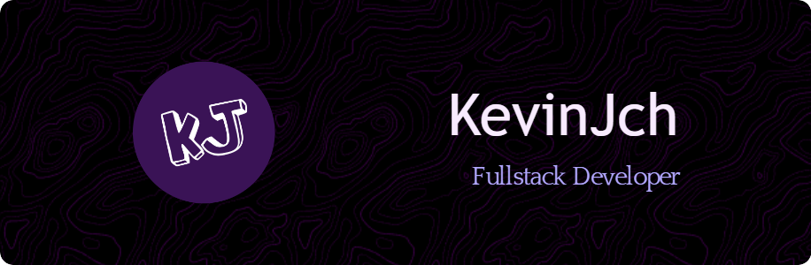

<h1 align="center"> Hi there, i am Kevin👋 </h1>

<h3> Here's some fun facts about me: </h3>

- **I'm an ***adventurous person who likes challenges***⚡**
-  **I'm a web developer who's constantly growing 👩🏻‍💻**
-  **I am an animal and nature lover 🦥🌱**
-  **I really like playing video games! 👾** 

### Here's the languages that I am currently working on:

### Technologies and tools:

## GitHub Stats

 
    

|                                                                                                      Kevin's Stars                                               |                                                             
 

|                                                                                                Top Languages                                                           | 

## Thank you for visiting my profile 😎
<!--
**JCHKevin/JCHKevin** is a ✨ _special_ ✨ repository because its `README.md` (this file) appears on your GitHub profile.

Here are some ideas to get you started:

- 🔭 I’m currently working on ...
- 🌱 I’m currently learning ...
- 👯 I’m looking to collaborate on ...
- 🤔 I’m looking for help with ...
- 💬 Ask me about ...
- 📫 How to reach me: ...
- 😄 Pronouns: ...
- ⚡ Fun fact: ...
-->
